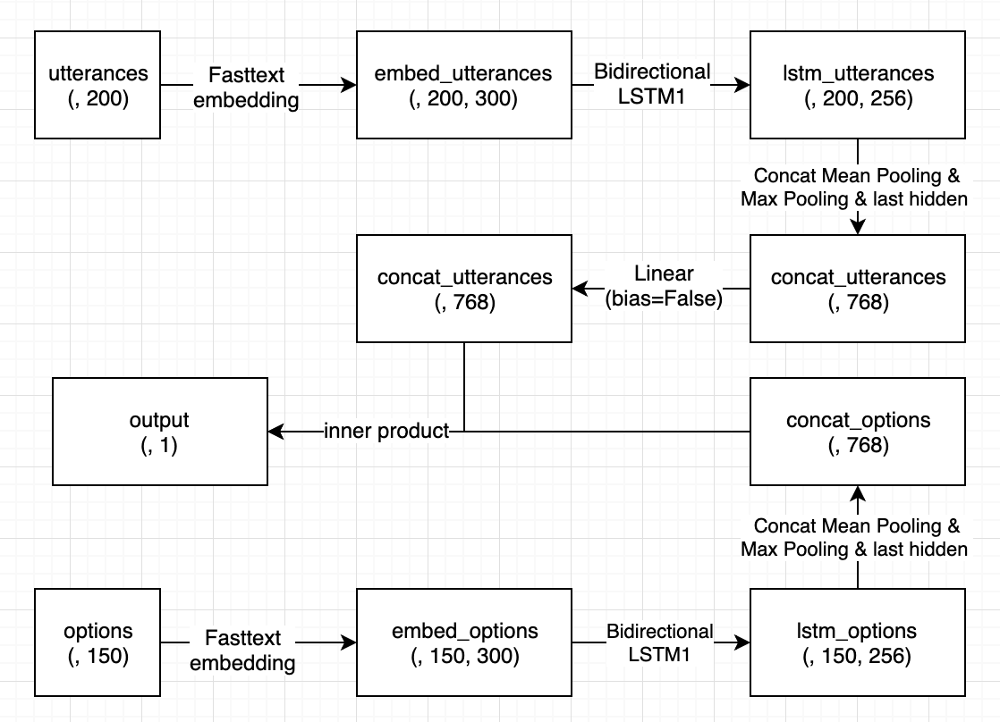
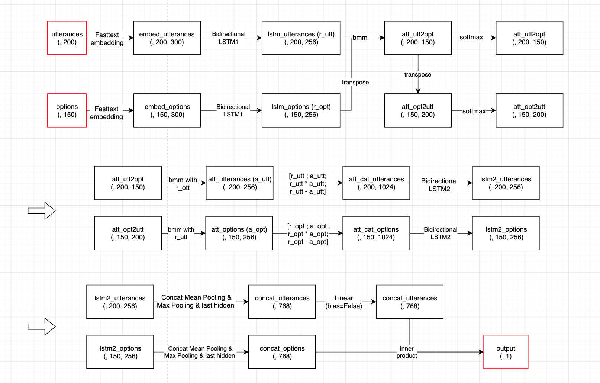
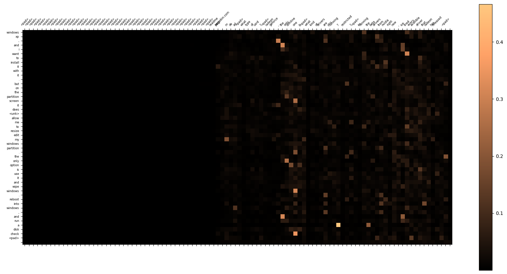
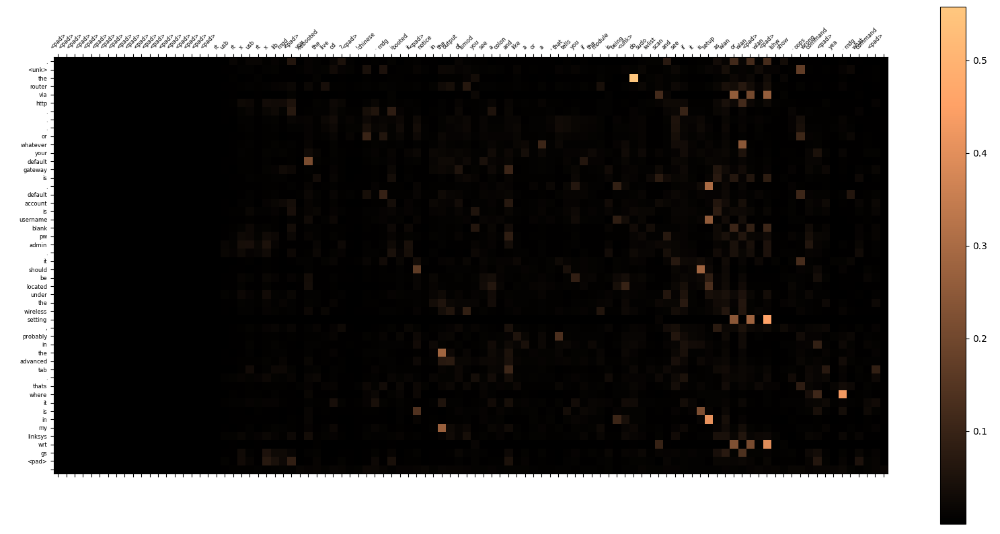
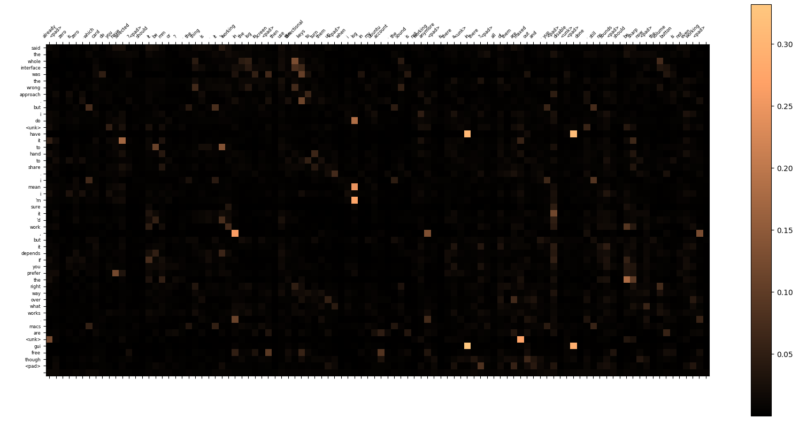

# ADL Homework 1 Report

> b05902002 資工三 李栢淵

#### Q1: Data processing (1%)

1. 1. How do you tokenize the data.

      - Lower all the word
      - replace character which is not 「a-z」「A-Z」「!」「?」「'」「,」「.」with " "

      - Use nltk package to tokenize.

   2. Number of negative samples used to train your model.

      4 for each data.

   3. Truncation length of the utterances and the options.

      utterances: 200, options: 150

   4. The pre-trained embedding you used.

      Fasttext: crawl-300d-2M.vec

2. 

#### Q2: Describe your RNN w/o attention model. (1%)

Model Structure:

​	After word embedding, I use a two layers bidirectional lstm on embed_utterence and embed_options. Then do the max pooling and mean pooling on each lstm output. For each, concat last output, max pooling output and mean pooling output, get two vector $a$ and $b$. Finally, calculate the score with $a^TWb$, which $W$ is a trainable weight. 

Performance:

- recall@10 (on validation set): 0.6504
- public leaderboard: 9.56666
- private leaderboard: 9.64571

Loss Function:

- BCEWithLogitsLoss

Optimization:

- Adam
- learning rate: 1e-3
- batch size: 100

#### Q3: Describe your RNN w/ attention model. (1%)

Model Structure -- Cross attention: 

​	After word embedding, I use a one layer bidirectional lstm1 on embed_utterence and embed_options and get the output **r_utt** and **r_opt**. and I get the attention map by $r_{utt}r_{opt}^T$ and names as att_utt2opt, adding a softmax on its dimension 2. Using this attension on r_opt and get the **a_utt** (attention of utterences). 

​	Meanwhile, transpose the att_utt2opt and get att_opt2utt, adding a softmax on its dimension 2.Using this attension on r_utt and get the **a_opt** (attention of options). This can be a kind of **cross attention**.

​	I concatenate two matrix (r and a) of utterences and options by **[r; a; r*a; r-a]** and get the att_cat_utterences and att_cat_options. And I used another one layer bidirectional lstm2 on them, getting 2 lstm2 output.

 	Then do the max pooling and mean pooling on each lstm2 output. For each, concat last output, max pooling output and mean pooling output, get two vector $a$ and $b$. Finally, calculate the score with $a^TWb$, which $W$ is a trainable weight.

Performance:

- recall@10 (on validation set): unknown
- public leaderboard: 9.33333
- private leaderboard: 9.39714

Loss Function:

- BCEWithLogitsLoss

Optimization:

- Adam
- learning rate: 1e-3
- batch size: 100

#### Q4: Describe your best model. (2%)

1. Describe (1%) 
2. I ensemble 11attention models above. The ensemble method is voting by 11 models and each model has 10 tickets. and output the top10 result.  

1. Performance:

2. - recall@10 (on validation set): 0.7698

3. - public leaderboard: 9.32666
   - private leaderboard: 9.35428

4. Loss Function and Optimization:

5. - as same as the attention model above

6. 

7. Describe the reason you think why your best model is better than your RNN w/ and w/o attention model. (1%)

   1. The advantage of ensemble

      Due to the instability of the only one attention model. I have trained two results, and one get the 9.34666 on publice board and another get 9.40.

      So the easiest way is using their output to vote and thier is a large improvent in private score.

      

   2. Cross attention vs Self attention

      I have trained a poor attention rnn model, which the different is that its attention weight is $r_{utt}r_{utt}^T$ and $r_{opt}r_{opt}^T$ and attent on itself. 

      But the better way is $r_{utt}r_{opt}^T$, which attent on the other one and it will **get the more imformation**. Utterence can access more imformation of options, and so do options.

      

   3. w/ attention vs w/o attention

      I find that self attention's result is little better than the rnn w/o attention's. I think that the reason is self attention model can not get more imformation and **just increase the model's complexity**.

      Compared with self attention, corss attention get more imformation as I mentioned above. So it can have a great improvement from rnn w/o attention.

   

#### Q5: Compare GRU and LSTM (1%)

|                                 |    LSTM     |      GRU       |
| ------------------------------- | :---------: | :------------: |
| recall@10 (on validation set)   | **0.7698**  |     0.7544     |
| public leaderboard / recall@10  | **9.33333** |    9.39333     |
| private leaderboard / recall@10 | **9.39714** |    9.40857     |
| required GPU memory             | about 2.6G  |  about **2G**  |
| training speed (sec per epoch)  | about 780s  | about **720s** |
| testing speed                   |     47s     |    **45s**     |

#### Q6: Visualize the attention weights (2%). 

1. Take one example in the validation set and visualize the attention weights (after softmax)

   *--> Notice that each row's sum is 1*

2. 

3. 

4. 

5. Describe your findings. (1%)

   I found that my attention not have some obviously feature. It might catch some similar vectors to mix a new states. Maybe it generate something meanful sequence and this really works!

   

   The another interesting dicoveries is that this attention could help handling the padding sequence, giving the `<pad>` word lower attention. Let the attented sequence has more useful imformation.

#### Q7: Compare different settings. (1% + bonus)

- Compare training with different settings:

- - different reasonable loss functions (1%).

- |                                 | BCEwithLogit |     BCE     |   MSE   |
  | ------------------------------- | :----------: | :---------: | :-----: |
  | recall@10 (on validation set)   |  **0.7698**  |    0.767    | 0.7674  |
  | public leaderboard / recall@10  | **9.33333**  |   9.37333   | 9.40000 |
  | private leaderboard / recall@10 | **9.39714**  | **9.39714** | 9.40857 |

- 

- - different number of negative samples (1%).

- |                                 |      3      |      4      |    9    |
  | ------------------------------- | :---------: | :---------: | :-----: |
  | recall@10 (on validation set)   |   0.7686    | **0.7698**  | 0.7596  |
  | public leaderboard / recall@10  |   9.37333   | **9.33333** | 9.38666 |
  | private leaderboard / recall@10 | **9.37428** |   9.39714   | 9.40571 |

- 

- - different number of utterances in a dialog (1%).

- |                                 |   100   |     200     |     300     |    400     |
  | ------------------------------- | :-----: | :---------: | :---------: | :--------: |
  | recall@10 (on validation set)   | 0.7684  |   0.7698    |   0.7698    | **0.7738** |
  | public leaderboard / recall@10  | 9.37333 | **9.33333** |   9.38666   |  9.40000   |
  | private leaderboard / recall@10 | 9.40000 |   9.39714   | **9.37428** |  9.39428   |

- 

- - different pre-trained word embeddings (1%).

- |                                 |  fasttext   | gensim  |
  | ------------------------------- | :---------: | :-----: |
  | Known Words Num                 |    57294    |  33951  |
  | recall@10 (on validation set)   | **0.7698**  | 0.6908  |
  | public leaderboard / recall@10  | **9.38666** | 9.60000 |
  | private leaderboard / recall@10 | **9.37428** | 9.60571 |

- 