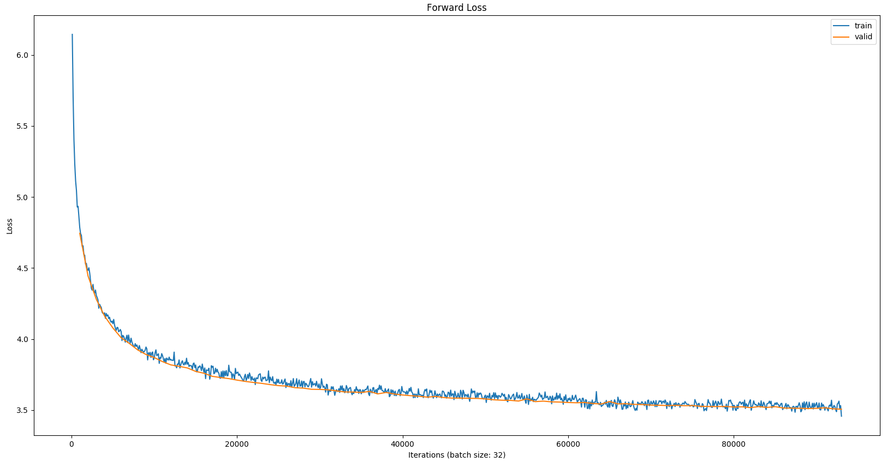

# ADL Homework 1 Report

> b05902002 資工三 李栢淵

### Q1: Describe your ELMo model. (2%)

1. Training corpus processing. (tokenization, vocabulary building) (0.4%)

   - tokenization: Has been finished by TA, using spacy tokenize.
   - I use the first 1000K sentences without any filtering and constrict their length to 64.
   - Only use the Top 80000 frequent word in vocabulary, the others are considered $[UNK]$

   

2. Model architecture and implementation details. (0.4%)

   Consider TA's suggestion, I used the CharEmbedding offered by TA, which contains HighwayNetwork using CNN to catch the relation between words and characters.

   

   After get the char embedding, I put the sequence to one-direction LSTM and then do the projection to the lower dimension on the output. And then do it again, including one-direction LSTM and projection.

   

   FInally, considering the large vocabulary set, I use the AdaptiveSoftmax as the final layer to accelerate.

   

   - Prepared Data: $[SOS], w_1, w_2, …, w_{64}, [EOS]​$

   - For Forword:

     - Input_f: $[SOS], w_1, w_2, …, w_{64}​$,  Labels_f: $w_1, w_2, …, w_{64}, [EOS]​$

     - Input_f -> CharEmbedding -> LSTM1_f -> Projection1_f -> 

       ​						     LSTM2_f -> Projection2_f -> AdaptiveSoftmax

   - For Backword:

     - Input_b: $[EOS], w_{64}, w_{63}, …, w_1​$,  Labels_f: $w_{64}, w_{63}, …, w_1, [SOS]​$

     - Input_b -> CharEmbedding -> LSTM1_b -> Projection1_b -> 

       ​						     LSTM2_b -> Projection2_b -> AdaptiveSoftmax

       

3. Hyperparameters of your ELMo model. (number of layers, hidden dimension, output dimension, optimization algorithm, learning rate and batch size) (0.4%)

   - CharEmbedding
     - num of embeddings: 260 (consider all char(0-255) and $[SOS], [EOS], [PAD], [UNK]$)
     - embedding dimension: 16
     - convolution filters: [(1, 32), (2, 64), (3, 128), (4, 128), (5, 256), (6, 256), (7, 512)]
     - n highways: 2
     - projection dimension: 512
   - ELMo
     - number of layers: 2
     - hidden dimension: 2048
     - projection dimension: 512
     - output dimension: 80000
     - cutoffs in AdaptiveLogSoftmaxWithLoss: [20,200,1000,10000]
   - others
     - optimization algorithm: Adam
     - learning rate: 1e-3
     - batch size: 32

   

4. Plot the perplexity score or loss on train/dev set while training. (0.4%)

   ​	Forward:

   ​	Backward:

   ​	Mean:

5. Show the performance of the BCN model with and without ELMo on the public leaderboard. (0.4%)

   - without ELMo

     

   - with ELMo

### Q2: Compare different settings for ELMo. (2%)

1. Different number of training steps. (1%)

   You can train one model for large number of training steps, then take the intermediate checkpoints for this problem.

   - 24000 iters

     

   - 38000 iters

     

   - 58000 iters

     

   - 74000 iters

   

   - 93000 iters

   

2. Different hyperparameters. (1%)

   The Same Setting:

   - First 500k sentences
   - vocabulary size: 50000
   - epochs 2

   Compared:

   - 

You need to report the performance of downstream task (at least the accuracy score on public leaderboard).

### Q3: Describe your model that passes strong baseline. (1%)

1. Input of your model. (word embedding? character embedding?) (0.4%)

   word embedding

2. Model architecture. (0.4%)

   Bert

3. Hyperparameters of your model. (optimization algorithm, learning rate, batch size and other model-specific options)  (0.2%)

   - optimization
   - learning rate
   - batch size

### Q4: Describe your best model. (1%)

1. Describe your best model (0.5%)

2. 1. Input to your model

      word embedding

   2. Model architecture

      Bert

   3. Hyperparameters (optimization algorithm, learning rate, batch size and other model-specific options)

      - optimization
      - learning rate
      - batch size

3. Describe the reason you think why your best model performs better than other models. (0.5%)

   

### Q5: Compare different input embeddings. (1%)

In this homework, you may encounter models taking inputs in different forms. Please compare the pros and cons of using **character embedding**, **word embedding** and **byte pair encoding**.

### Q6: BERT (2%)

1. Please describe the tasks that BERT used for pre-training. What benefits do they have comparing to language model pretraining used in ELMo? (1%)

   

2. Please describe in detail how you would formulate the problem in HW1 and apply BERT on it. (1%)

### Q7: Bonus

1. Compare more than 2 contextualized embedding on this task. (1%)

2. - CoVe
   - ELMo
   - OpenAI GPT
   - SpaCy
   - BERT
   - Report the accuracy of different methods.

3. Apply your ELMo embedding to other tasks. (1%)

   - [Stanford Question Answering Dataset (SQuAD)](https://rajpurkar.github.io/SQuAD-explorer/)
   - [Stanford Natural Language Inference (SNLI) Corpus](https://nlp.stanford.edu/projects/snli/)
   - [CoNLL-2003 Named Entity Recognition](https://www.clips.uantwerpen.be/conll2003/ner/)
   - [CoNLL-2012 Coreference Resolution](http://conll.cemantix.org/2012/task-description.html)
   - Please contact TA if you want to try on other interesting tasks.

4. Apply any kind of contextualized embedding method on HW1 and report the performance. (1%)

   I use the ELMo embedding which training on the given corpus on HW1 instead of GloVe.

   