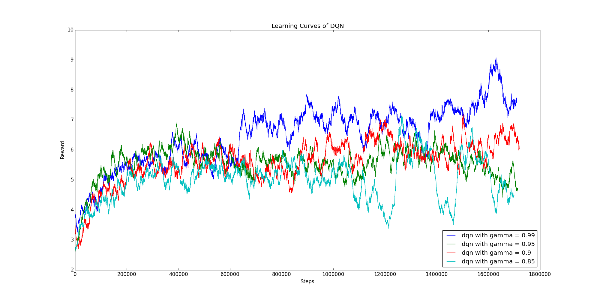

# ADL Homework 3 Report

> b05902002 資工三 李栢淵

### 1. Basic Performance (6%)

##### Describe your Policy Gradient & DQN model (1% + 1%)

1. Policy Gradient model

   - Save every actions, states and rewards
   - Use the PolicyNet get the probability of each actions
   - Update the policy loss by saved actions, states and rewards

2. DQN model

   - Save every states, actions, rewards, next_states and  done
   - 

   

Plot the learning curve to show the performance of your Policy Gradient on **LunarLander** (2%)

Plot the learning curve to show the performance of your DQN on **Assualt** (2%)

- X-axis: number of time steps

- Y-axis: average reward in last n episodes. You can arbitrarily choose n to make your figure clear

1. Policy Gradient on **LunarLander**

   Calculating average rewards  in last 100 episodes

   

2. DQN on **Assualt**

   Calculating average rewards  in last 100 episodes

   

   

### 2. Experimenting with DQN hyperparameters (2%)

Choose one hyperparameter of your choice and run at least three other settings of this hyperparameter

You should find a hyperparameter that makes a nontrivial difference to DQN.

##### << Experiment on Assualt >>

##### Explain why you choose this hyperparameter and how it affect the results (0.5% + 0.5%)

Gamma是對於未來的expected q-value以一定混進現在reward的比例，理論上Gamma越大，對於未來會更加注意。

而且在研究的過程中，發現大部分的tutorial都直接將Gamma設定為0.99，想看看調整這個執會有什麼影響。

在初步的測試下，發現Gamma太低會讓整個model爛掉。

所以考慮的參數有0.99, 0.95, 0.9, 0.85。

##### Plot all four learning curves in the same figure (1%)

由上圖我們可以發現到，Gamma越大，在前期的收斂速度越慢，但是長期下來可以得到相對較好的結果。而且，0.9以下的Gamma對於model來說就有點過小了。當Gamma是0.95時，在五萬steps前都有相對較好的Reward。

所以如果想在短時間獲得好一點的結果，是可以把Gamma調小一點點(0.95)試試看的。

### 3. Improvements to Policy Gradient & DQN / Other RL methods (2% + 2%)

Choose two improvements to PG & DQN or other RL methods.

For each method you choose,
- describe why they can improve the performance (1%)
- plot the graph to compare results with and without improvement (1%)

##### << Experiment on Assualt >>

1. Double DQN

   

   

2. Duel DQN

   

   

3. Noisy DQN

   

4. Prioritized DQN

   

   表現的狀況比預期的糟很多，因為结合了 prioritized experience replay，理論上比原本random sample更好，可能是alpha跟beta要多加調整。

   

因為基本上每一種improvement都不算特別成功，所以額外多了兩種improvement，看看訓練過程的變化。也有可能是Train得不夠久，礙於計算資源，只能得到這些結果，希望日後能有機會嘗試多種組合或是多種參數，像是Rainbow那樣。