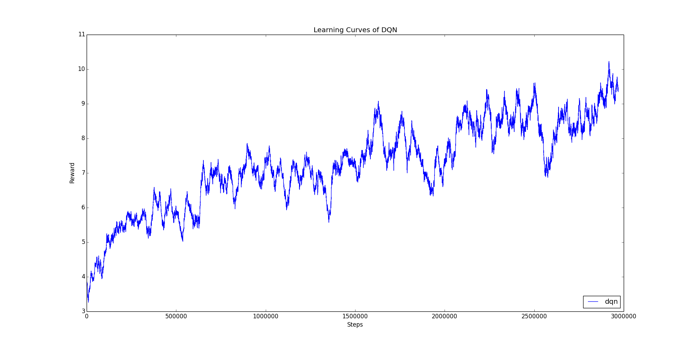

# ADL Homework 3 Report

> b05902002 資工三 李栢淵

### 1. Basic Performance (6%)

##### Describe your Policy Gradient & DQN model (1% + 1%)

1. Policy Gradient model

   - Run the game and save every actions, states and rewards
   - Use the PolicyNet get the probability of each actions
   - Calculate the policy loss by saved actions, states and rewards and update

2. DQN model

   - Run the game and save every states, actions, rewards, next_states and  done
   - Calculate the q-values and expected q-value , using them to calculate loss and update online_net model every 4 steps
   - Copy online_net model to target_net model every 1000 steps

   

Plot the learning curve to show the performance of your Policy Gradient on **LunarLander** (2%)

Plot the learning curve to show the performance of your DQN on **Assualt** (2%)

- X-axis: number of time steps

- Y-axis: average reward in last n episodes. You can arbitrarily choose n to make your figure clear

1. Policy Gradient on **LunarLander**

   Calculating average rewards  in last 100 episodes

   

2. DQN on **Assualt**

   Calculating average rewards  in last 100 episodes

   

   

### 2. Experimenting with DQN hyperparameters (2%)

Choose one hyperparameter of your choice and run at least three other settings of this hyperparameter

You should find a hyperparameter that makes a nontrivial difference to DQN.

##### << Experiment on Assualt >>

##### Explain why you choose this hyperparameter and how it affect the results (0.5% + 0.5%)

Gamma是對於未來的expected q-value以一定混進現在reward的比例，理論上Gamma越大，對於未來會更加注意。

而且在研究的過程中，發現大部分的tutorial都直接將Gamma設定為0.99，想看看調整這個執會有什麼影響。

在初步的測試下，發現Gamma太低會讓整個model爛掉。

所以考慮的參數有0.99, 0.95, 0.9, 0.85，不考慮太低的。(y軸的值為10個episodes的總和，後來有更正，僅供參考使用)

##### Plot all four learning curves in the same figure (1%)

由上圖我們可以發現到，Gamma越大，在前期的收斂速度越慢，但是長期下來可以得到相對較好的結果。當Gamma是0.95時，在五萬steps前都有相對較好的Reward。

所以如果想在短時間獲得好一點的結果，是可以把Gamma調小一點點(0.95)試試看的。

而且，0.9以下的Gamma對於model來說就有點過小了。當Gamma過小時，後期的震盪較大。

### 3. Improvements to Policy Gradient & DQN / Other RL methods (2% + 2%)

- describe why they can improve the performance (1%)
- plot the graph to compare results with and without improvement (1%)

##### << Experiment on Assualt >>

1. Double DQN

   

   透過不拿online_net出來的q_values的最大值，而是由target_net決定要從online_net拿出哪個值，這樣的方法有效避免over estimation，比起原本的DQN，前期成長的比較快，後面的收斂也比較平穩。

2. Duel DQN

   

   Duel DQN 改變的是：改動model，再將q-value拆成另外兩個變數相加。根據他人說法，這個方法簡單且強力。但實際上感覺是還好，只有上升的比較穩定一些。

3. Noisy DQN

   

   其實Noisy DQN的結果變化滿大的，因為原本有先train了比較小的steps的圖，發現noisy DQN有變好滿多的。

   重train一次後發現，越後面的收斂跟原本的DQN似乎沒差多少。只有一開始的時候好比較多。

4. Prioritized DQN

   

   表現的狀況比預期的糟很多，因為结合了 prioritized experience replay，理論上比原本experience replay的random sample更好。最後得出的原因可能是hyperparameter的問題，alpha跟beta要多tune。

   

因為基本上每一種improvement都不算特別成功，所以額外多了兩種improvement，多試點不同的方法，順便看看訓練過程的變化。目前找不太到improvement失敗的原因，也換過loss function，可能還要在特定的improvement多下點苦功才能得到結論。

也有可能是Train得不夠久，網路上別人的結果，橫軸的量級都是幾百million，可能來不及train到最好的狀態。礙於計算資源，只能得到這些結果，希望日後能有機會嘗試多種組合或是多種參數，像是Rainbow那樣，混雜多種improvements。

