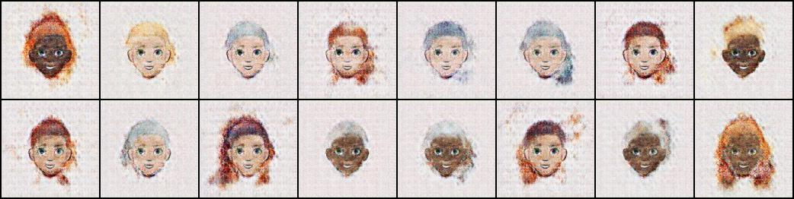
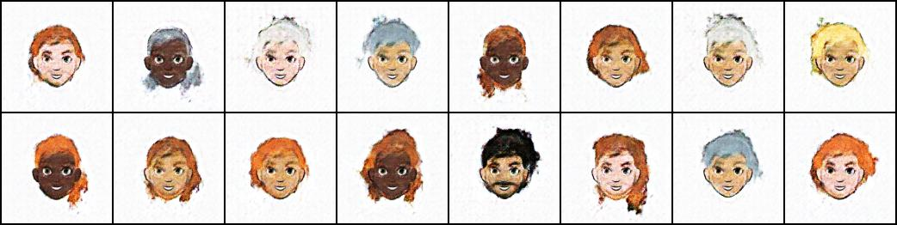
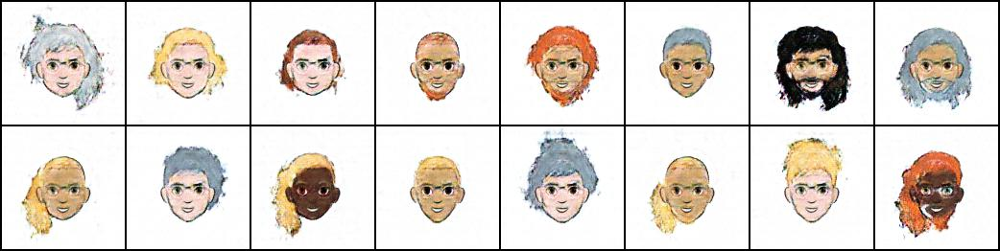
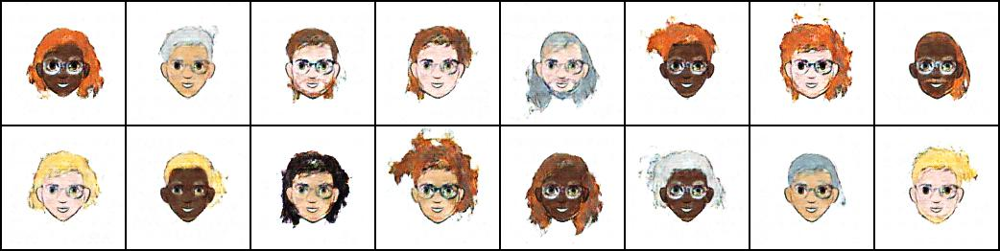
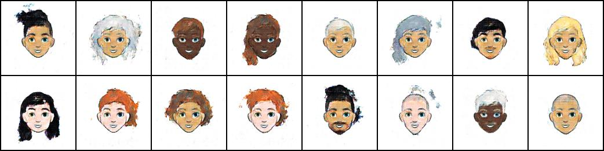
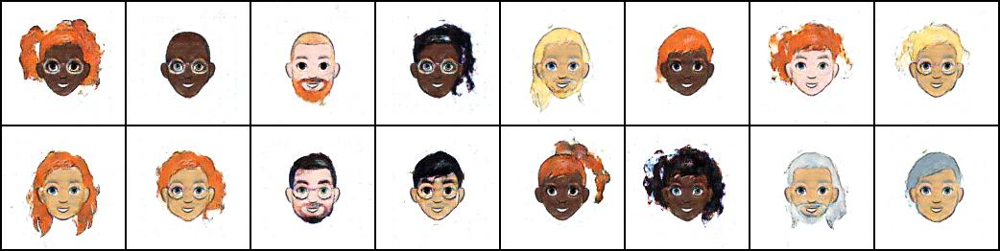
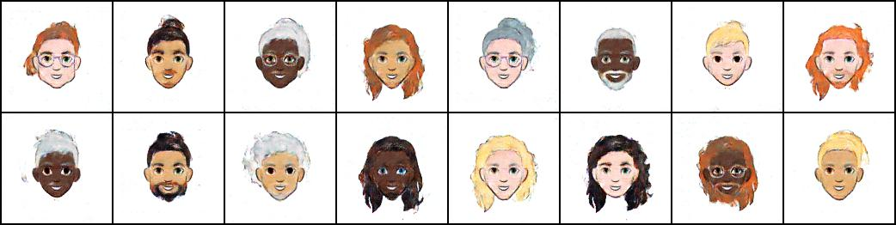
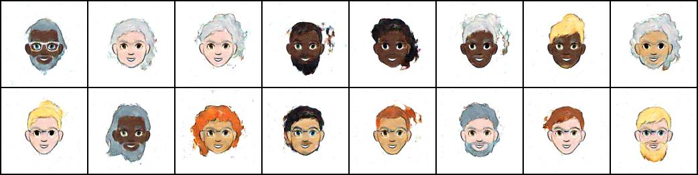
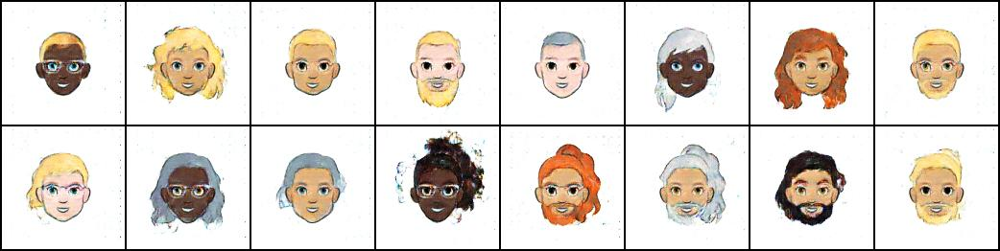
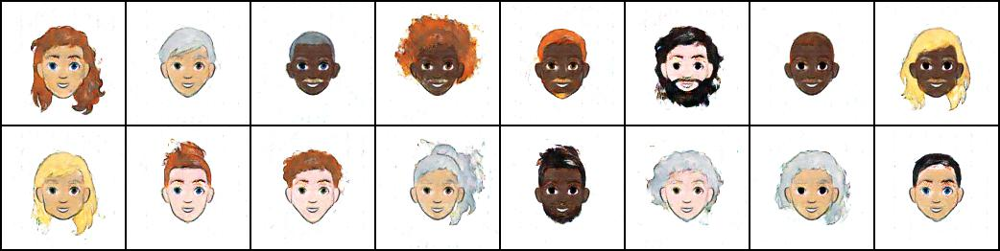

# ADL Homework 4 Report

> b05902002 資工三 李栢淵

### 1. Explain the structure of your **networks** and **loss terms** in detail (1.5%)

##### Structure of Generator

##### Structure of Discriminator

##### Other Properties

- Loss
  - Binary cross entropy on synthesis and condition
- Optimizer
  - Adam
    - learning rate: 0.0002
    - beta1: 0.5
- Noise size
  - 200

### 2. Plot your training progress (10 pics) (0.5%)

| <b>Epoch: 1</b>  |
| :-----------------------------------: |
| <b>Epoch: 2</b>  |
| <b>Epoch: 3</b>  |
| <b>Epoch: 4</b>  |
| <b>Epoch: 5</b>  |
| <b>Epoch: 6</b>  |
| <b>Epoch: 7</b>  |
| <b>Epoch: 8</b>  |
| <b>Epoch: 9</b>  |
| <b>Epoch: 10</b>  |

### 3. Design at least 3 different experiments. Describe your settings, making comparisons and report your observations. (4% + 0.5% bonus)

- - You may be deducted some points if TAs consider your experiments “太過敷衍”
  - EX: Normalizing the input image to [-1,1] is considered too simple and basic
  - 幾個參考方向: GAN的不同objective、model condition on label 的方式、各種tricks .

#### Experiment1: Different batch size

- Batch size: 32
  - 梯度爆炸:   epoch
  - FID score: 

- Batch size: 16
  - 梯度爆炸:  69 epoch
  - FID score: 63.257

- Batch size: 8
  - 梯度爆炸:  69 epoch
  - FID score: 63.257

#### Experiment2: Condition on Label

#### Experiment3: Different batch size

